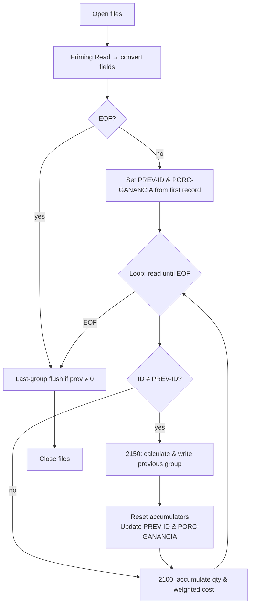
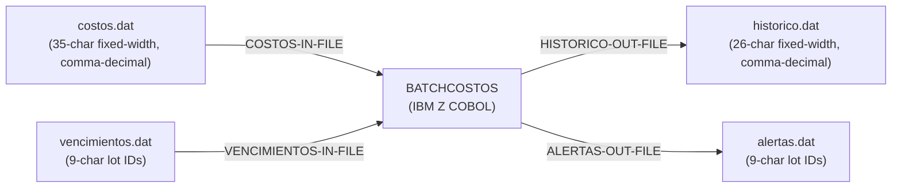
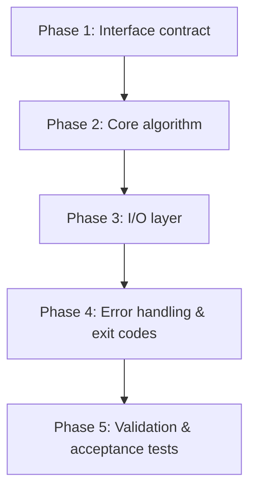
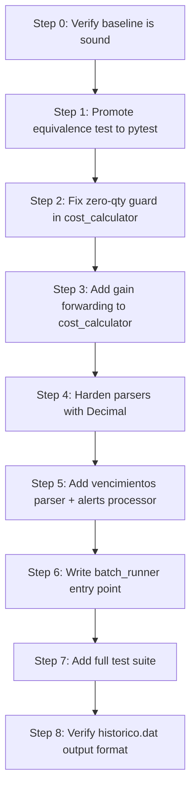
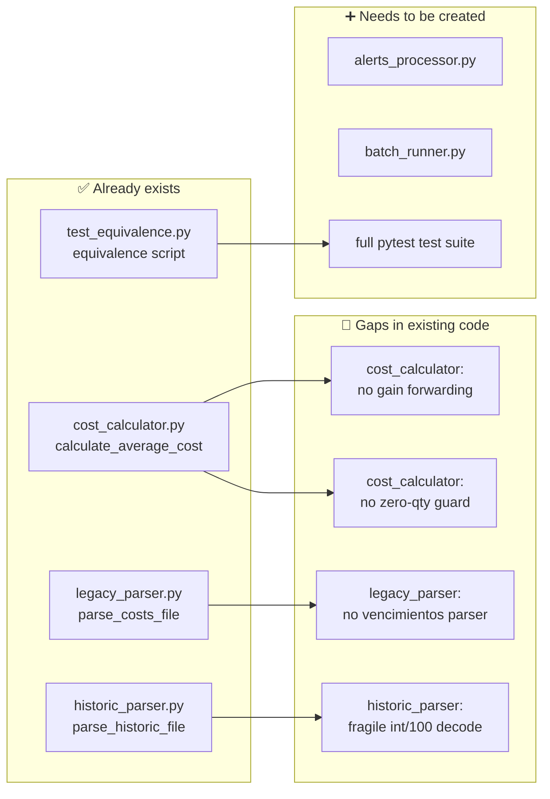

# Analyze legacy/cobol/batchcosto.cob as a legacy modernization specialist.

Do not modify any files.

Identify and explain:
1. The business rules implemented by the program.
2. Input and output files and their record structures.
3. The control-break logic used to group records by product.
4. How the weighted average cost is calculated.
5. How decimal values are represented and transformed.
6. The program's dependencies and data flow.
7. Potential risks when modernizing this program.
8. Observable behavior that a modern implementation must preserve.
9. A concise modernization plan that could be used to migrate this component to Python while preserving behavior.

Base the analysis strictly on the repository contents. Do not invent
business rules or dependencies that are not present in the code.

Do not modify any files.

---

**Status:** active  **Date:** 2026-09-26

---

### 👤 User

Analyze legacy/cobol/batchcosto.cob as a legacy modernization specialist.

Do not modify any files.

Identify and explain:
1. The business rules implemented by the program.
2. Input and output files and their record structures.
3. The control-break logic used to group records by product.
4. How the weighted average cost is calculated.
5. How decimal values are represented and transformed.
6. The program's dependencies and data flow.
7. Potential risks when modernizing this program.
8. Observable behavior that a modern implementation must preserve.
9. A concise modernization plan that could be used to migrate this component to Python while preserving behavior.

Base the analysis strictly on the repository contents. Do not invent
business rules or dependencies that are not present in the code.

Do not modify any files.

---

### 🤖 Assistant

> 🔧 called: read_file


> 🔧 **read_file** — legacy/cobol/batchcosto.cob

### 🤖 Assistant

> 🔧 called: list_files, glob

Now let me check if there are sample data files or any other related assets in the repository:

> 🔧 **list_files** — legacy

> 🔧 **glob** — **/*.dat

### 🤖 Assistant

> 🔧 called: read_file, read_file, read_file, read_file


> 🔧 **read_file** — legacy/cobol/costos.dat

> 🔧 **read_file** — legacy/cobol/vencimientos.dat

> 🔧 **read_file** — legacy/cobol/historico.dat

> 🔧 **read_file** — legacy/cobol/alertas.dat

### 🤖 Assistant

> 🔧 called: read_file, read_file


> 🔧 **read_file** — legacy/cobol/costos_dot.dat

> 🔧 **read_file** — legacy/cobol/costos_comma.dat

### 🤖 Assistant

> 🔧 called: grep, grep


> 🔧 **grep** — .

> 🔧 **grep** — .

### 🤖 Assistant

> 🔧 called: grep, grep


> 🔧 **grep** — legacy/cobol/alertas.dat

> 🔧 **grep** — legacy/cobol/historico.dat

### 🤖 Assistant

> 🔧 called: read_file, list_files


> 🔧 **list_files** — legacy/data

> 🔧 **read_file** — legacy/cobol/batchcosto_before_fix.cob

### 🤖 Assistant

I now have a complete picture of the program and its actual data. Here is the full analysis.

---

## BATCHCOSTOS — Legacy Modernization Analysis

### Program identity

[`PROGRAM-ID. BATCHCOSTOS`](legacy/cobol/batchcosto.cob:2) — a pure-batch, no-SQL COBOL program targeting IBM Z. Written 2025-11-09 by Florencia Sombra. The companion file [`batchcosto_before_fix.cob`](legacy/cobol/batchcosto_before_fix.cob) is an earlier version that still contained DEBUG `DISPLAY` statements and a bug in [`2200-GUARDAR-HISTORICO`](legacy/cobol/batchcosto_before_fix.cob:251) (it reused live working-storage fields instead of dedicated temp variables to format output — fixed in the current version).

---

### 1. Business rules

| # | Rule | Source |
|---|------|--------|
| R1 | Input records represent **lots (lotes) of a product**. Multiple lots can share the same `PRODUCTO-ID`. | [`costos.dat`](legacy/cobol/costos.dat) |
| R2 | For each product group the program computes a **weighted average cost** across all its lots: `Σ(price × qty) / Σ(qty)`. | [`2150-CALCULAR-Y-GRABAR`](legacy/cobol/batchcosto.cob:217) |
| R3 | The weighted average is **only written if total quantity > 0**, preventing a divide-by-zero. | [`2150-CALCULAR-Y-GRABAR` line 219](legacy/cobol/batchcosto.cob:219) |
| R4 | The **profit percentage (`PORC-GANANCIA`)** is carried from the *first* lot of each product group into the output. It is not averaged; it is simply forwarded. | [`2150-CALCULAR-Y-GRABAR` line 225](legacy/cobol/batchcosto.cob:225) |
| R5 | Lots listed in `vencimientos.dat` are copied verbatim to `alertas.dat`; no filtering or enrichment happens. The program acts as a passthrough for expiration alerts. | [`3100-INSERTAR-ALERTA`](legacy/cobol/batchcosto.cob:284) |
| R6 | On any write error the program closes all files, sets `RETURN-CODE = 8`, and exits immediately. | [`9900-ERROR-FATAL`](legacy/cobol/batchcosto.cob:298) |

---

### 2. Input and output files and their record structures

All files are **LINE SEQUENTIAL** (one record per newline), with fixed-width text fields — no delimiters between fields; fields are positionally packed.

#### `costos.dat` — Input

| Field | COBOL name | PIC | Width | Example |
|-------|-----------|-----|-------|---------|
| Product ID | `CR-PRODUCTO-ID` | `X(9)` | 9 | `000000001` |
| Profit % | `CR-PORC-GANANCIA` | `X(6)` | 6 | `025,50` |
| Quantity | `CR-CANTIDAD` | `X(9)` | 9 | `      10` |
| Unit cost | `CR-PRECIOCOSTO` | `X(11)` | 11 | `     150,75` |

Total record width: **35 characters** + newline.

Real data from [`costos.dat`](legacy/cobol/costos.dat):
```
000000001025,50       10     150,75
000000001025,50       20     200,00
000000002030,00        5     100,00
...
```

#### `vencimientos.dat` — Input

| Field | COBOL name | PIC | Width |
|-------|-----------|-----|-------|
| Lot ID | `VR-LOTE-ID` | `X(9)` | 9 |

Real data: lot IDs `000000001`, `000000003`, `000000005`.

#### `historico.dat` — Output

| Field | COBOL name | PIC | Width |
|-------|-----------|-----|-------|
| Product ID | `HR-PRODUCTO-ID` | `X(9)` | 9 |
| Weighted avg cost | `HR-COSTO-PROMEDIO` | `X(11)` | 11 |
| Profit % | `HR-PORC-GANANCIA` | `X(6)` | 6 |

Total output record width: **26 characters** + newline.

#### `alertas.dat` — Output

| Field | COBOL name | PIC | Width |
|-------|-----------|-----|-------|
| Lot ID | `AR-LOTE-ID` | `X(9)` | 9 |

Content is identical to `vencimientos.dat` (passthrough copy).

---

### 3. Control-break logic

The program uses the classic **priming-read / control-break** pattern on `PRODUCTO-ID`:



Key details:
- [`WS-PREV-PRODUCTO-ID`](legacy/cobol/batchcosto.cob:141) holds the "current group" key.
- The **priming read** at line 165–170 seeds `WS-PREV-PRODUCTO-ID` before the main loop.
- The **last-group flush** at lines 184–186 handles the final product group that would otherwise never trigger a control-break.
- The **prerequisite for correctness**: `costos.dat` **must be sorted by `PRODUCTO-ID`**. The program has no sort step and no out-of-order detection.

---

### 4. Weighted average cost calculation

```
WS-TOTAL-COSTO-VALOR  +=  WS-PRECIOCOSTO-N  × WS-CANTIDAD-N   (for each lot in group)
WS-TOTAL-CANTIDAD     +=  WS-CANTIDAD-N

WS-COSTO-PROMEDIO  =  WS-TOTAL-COSTO-VALOR / WS-TOTAL-CANTIDAD  (ROUNDED)
```

Source: [`2100-ACUMULAR-TOTALES`](legacy/cobol/batchcosto.cob:209) and [`2150-CALCULAR-Y-GRABAR`](legacy/cobol/batchcosto.cob:217).

Manual verification with product `000000001` (first two rows of `costos.dat`):

| Lot | Price | Qty | Price × Qty |
|-----|-------|-----|-------------|
| 1 | 150,75 | 10 | 1507,50 |
| 2 | 200,00 | 20 | 4000,00 |
| **Total** | | **30** | **5507,50** |

Weighted avg = 5507,50 / 30 = **183,58** (rounded to 2 decimal places).

The accumulator [`WS-TOTAL-COSTO-VALOR`](legacy/cobol/batchcosto.cob:94) is `PIC S9(13)V99 COMP-3` — it can hold up to 13 integer digits with 2 decimal places in packed-decimal form. The divisor [`WS-TOTAL-CANTIDAD`](legacy/cobol/batchcosto.cob:95) is `PIC S9(9) COMP` (binary integer, up to 999,999,999 units).

---

### 5. Decimal values: representation and transformation

This is one of the most critical modernization points.

#### The `DECIMAL-POINT IS COMMA` declaration

[`SPECIAL-NAMES. DECIMAL-POINT IS COMMA.`](legacy/cobol/batchcosto.cob:29)

This IBM Z COBOL clause **swaps the roles of comma and period** throughout the entire compilation unit:
- The comma `,` becomes the decimal separator.
- The period `.` becomes the thousands separator (though not used here).
- All `PIC` numeric literals in the source and all `NUMVAL()` calls operate on comma-separated strings.

#### Data file encoding

In `costos.dat` the values are written with commas as decimal points:
```
025,50   ← means 25.50 (profit %)
     150,75   ← means 150.75 (unit cost)
```

#### Conversion pipeline

```
Text field (PIC X) → FUNCTION NUMVAL(...) → Internal numeric (PIC 9/S9Vnn COMP-3)
```

[`2020-CONVERTIR-DATOS-COSTOS`](legacy/cobol/batchcosto.cob:200) applies `NUMVAL` to all four text fields. Under `DECIMAL-POINT IS COMMA`, `NUMVAL("150,75")` correctly parses to the value 150.75.

#### Output formatting

In [`2200-GUARDAR-HISTORICO`](legacy/cobol/batchcosto.cob:239), the numeric result is moved to a temp `PIC 9(8)V99` field and then `STRING ... DELIMITED BY SIZE` is used to write its character representation into the fixed-width `X(11)` output field. Under `DECIMAL-POINT IS COMMA` the COBOL runtime will render the decimal as a comma, so the output file will also contain comma-decimal notation.

#### Internal precision

| Variable | PIC | COMP usage | Notes |
|----------|-----|-----------|-------|
| `WS-TOTAL-COSTO-VALOR` | `S9(13)V99` | COMP-3 | Packed decimal, 2 implied decimal places |
| `WS-TOTAL-CANTIDAD` | `S9(9)` | COMP | Binary integer |
| `WS-COSTO-PROMEDIO` | `S9(8)V99` | COMP-3 | Result, 2 d.p., ROUNDED on COMPUTE |
| `WS-PORC-GANANCIA` | `S9(3)V99` | COMP-3 | Profit %, 2 d.p. |

---

### 6. Dependencies and data flow



**External dependencies:**
- No database (SQL-free by design).
- No JCL DD statements visible in the source — file names are hardcoded string literals (`"costos.dat"`, etc.), meaning the working directory at runtime determines where files are resolved.
- No COPY books, sub-programs (`CALL`), or external modules referenced anywhere.
- Compiled and run on IBM Z; `SOURCE-COMPUTER / OBJECT-COMPUTER` are both `IBM-Z`.

**Ordering dependency (implicit):**
- `costos.dat` must arrive **pre-sorted by `PRODUCTO-ID` ascending**. The program never sorts; out-of-order records produce wrong weighted averages silently.

**The `batchcosto_before_fix.cob` diff (what was fixed):**
- Removed all `DISPLAY "DEBUG..."` statements.
- In `2200-GUARDAR-HISTORICO` the old version reused `WS-PRECIOCOSTO-N` and `WS-PORC-GANANCIA-N` (the *input* conversion fields) as intermediate STRING targets, which could corrupt in-flight working storage. The fix introduced dedicated `WS-HR-COSTO-TEMP` and `WS-HR-GANANCIA-TEMP` fields ([`batchcosto.cob` lines 112–113](legacy/cobol/batchcosto.cob:112)).

---

### 7. Potential risks when modernizing

| Risk | Severity | Detail |
|------|----------|--------|
| **Decimal separator** | 🔴 Critical | `DECIMAL-POINT IS COMMA` means every numeric value in files uses `,` not `.`. A Python implementation using `float("150,75")` will crash. Must replace `,` → `.` on parse, and write `,` on output. |
| **Implicit input sort assumption** | 🔴 Critical | The algorithm is entirely wrong if records for the same product are not contiguous. Python must either enforce/validate sort order or use a group-by accumulator approach that tolerates unsorted input. |
| **Fixed-width positional parsing** | 🟠 High | Fields are not delimited — they are extracted by exact character offset. Python must slice by byte position, not by whitespace split. |
| **ROUNDED arithmetic** | 🟠 High | `COMPUTE ROUNDED` on `COMP-3` uses IBM's half-even (banker's rounding) by default in many COBOL implementations. Python's `round()` also uses half-even, but `decimal.ROUND_HALF_UP` is sometimes expected in financial contexts. The exact rounding mode must be confirmed and replicated. |
| **Output field width** | 🟠 High | `HR-COSTO-PROMEDIO` is exactly 11 characters and `HR-PORC-GANANCIA` is exactly 6 characters. The Python writer must format numbers to the same widths and decimal notation or any downstream consumer of `historico.dat` will break. |
| **`PORC-GANANCIA` source ambiguity** | 🟡 Medium | The profit % written to output is taken from the **first lot record** of each product group (set at priming read or at control-break). If different lots for the same product carry different `PORC-GANANCIA` values, later lots' values are silently ignored. Python must replicate this "first-wins" semantics. |
| **Zero-quantity guard** | 🟡 Medium | The COBOL code skips output when `WS-TOTAL-CANTIDAD = 0`. A Python implementation that doesn't replicate this guard will either divide by zero or write a bogus zero-cost record. |
| **Return code convention** | 🟡 Medium | The program sets `RETURN-CODE = 8` on fatal error, following IBM Job Control conventions. A Python replacement must propagate `sys.exit(8)` for the same error conditions so any surrounding orchestration (e.g. job scheduler) continues to work. |
| **Empty file edge case** | 🟡 Medium | The priming-read guard (`IF NOT NO-HAY-MAS-COSTOS`) prevents a crash on empty input. Python must handle the empty-file case without errors. |
| **`historico.dat` truncation** | 🟢 Low | The output file is opened with `OUTPUT` (overwrite), not `EXTEND`. Each run completely replaces the previous output. Python's `open(..., 'w')` matches this — but `open(..., 'a')` would not. |

---

### 8. Observable behavior a modern implementation must preserve

1. **Input**: reads `costos.dat` with fixed-width positional fields (9+6+9+11 chars/record) where decimal separator is `,`.
2. **Input**: reads `vencimientos.dat` with 9-char fixed-width lot IDs, one per line.
3. **Costos processing**: groups contiguous records by `PRODUCTO-ID`; on product change, computes and flushes one output record.
4. **Weighted average**: `Σ(cost × qty) / Σ(qty)`, rounded to 2 decimal places.
5. **Profit %**: forwarded from the first record of each product group, not recalculated.
6. **Guard**: if `Σ(qty) = 0` for a group, no output record is written for that product.
7. **Output `historico.dat`**: overwrites entirely; one record per product group; fixed-width 9+11+6 chars; decimal separator `,`.
8. **Output `alertas.dat`**: overwrites entirely; exact passthrough copy of `vencimientos.dat`, one 9-char lot ID per line.
9. **Counters displayed**: prints count of cost records written and count of alerts written.
10. **Exit code**: `0` on success, `8` on any write error (with all files closed before exit).

---

### 9. Modernization plan: COBOL → Python



#### Phase 1 — Lock down the interface contract
- Document the exact field offsets and widths for every file (derived from the `PIC X(n)` sizes above).
- Capture representative samples of `costos.dat` and `historico.dat` (including the comma-decimal format) as regression fixtures.

#### Phase 2 — Implement the core algorithm

```python
# Use decimal.Decimal for exact arithmetic — avoids float precision drift
from decimal import Decimal, ROUND_HALF_EVEN
from itertools import groupby

def parse_cost(raw: str) -> Decimal:
    # DECIMAL-POINT IS COMMA → replace comma with dot before parsing
    return Decimal(raw.strip().replace(',', '.'))

def weighted_avg(lots: list[tuple[Decimal, int]]) -> Decimal:
    total_value = sum(price * qty for price, qty in lots)
    total_qty   = sum(qty for _, qty in lots)
    if total_qty == 0:
        return None
    return (total_value / total_qty).quantize(Decimal('0.01'), rounding=ROUND_HALF_EVEN)
```

Key Python choices:
- `decimal.Decimal` replicates `COMP-3` packed-decimal arithmetic without float error.
- `ROUND_HALF_EVEN` matches COBOL `ROUNDED` on IBM Z.
- `itertools.groupby` can replace control-break **only if input is sorted**; otherwise use `collections.defaultdict` to accumulate by key (safer, removes the sort precondition).

#### Phase 3 — I/O layer

```python
def parse_costos_record(line: str) -> dict:
    # Positional slicing — do NOT use split()
    return {
        'producto_id':   int(line[0:9]),
        'porc_ganancia': parse_cost(line[9:15]),
        'cantidad':      int(line[15:24].strip()),
        'precio_costo':  parse_cost(line[24:35]),
    }

def format_historico_record(producto_id: int, costo_prom: Decimal, porc_gan: Decimal) -> str:
    # Output: 9-char ID + 11-char cost (comma-decimal) + 6-char profit%
    costo_str = f"{costo_prom}".replace('.', ',').rjust(11)
    ganancia_str = f"{porc_gan}".replace('.', ',').rjust(6)
    return f"{producto_id:09d}{costo_str}{ganancia_str}"
```

#### Phase 4 — Error handling and exit codes

```python
import sys

try:
    with open('historico.dat', 'w') as f:
        f.write(record + '\n')
except OSError as e:
    print(f"ERROR ESCRIBIENDO historico.dat: {e}")
    sys.exit(8)   # Preserve RETURN-CODE = 8 convention
```

#### Phase 5 — Acceptance tests

Write pytest fixtures that:
1. Feed the known `costos.dat` (10 records, 5 products) and assert the exact bytes of `historico.dat`.
2. Feed `vencimientos.dat` and assert `alertas.dat` is byte-for-byte identical.
3. Test empty `costos.dat` → no output, exit 0.
4. Test a product group with `qty = 0` → no output record for that product.
5. Test a write failure → exit code is `8`.

#### Recommended project structure

```
batchcostos/
├── batchcostos.py         # main entry point, mirrors 0000-MAIN-PROCEDURE
├── costos.py              # parse_costos_record, weighted_avg, process_costos
├── alertas.py             # process_alertas
├── io_utils.py            # file open/close/error wrappers
└── tests/
    ├── fixtures/
    │   ├── costos.dat
    │   ├── vencimientos.dat
    │   └── expected_historico.dat
    └── test_batchcostos.py
```

The `DECIMAL-POINT IS COMMA` clause and the fixed-width positional layout are the two most dangerous migration traps. Everything else follows directly from translating COBOL paragraph semantics into Python functions one-to-one.

---

### 👤 User

Using the previous analysis of legacy/cobol/batchcosto.cob and the
existing legacy-modern equivalence baseline, create a detailed
modernization plan for this component.

Do not modify any files.

The modernization must preserve observable legacy behavior.

Include:

1. Legacy behavior that must remain unchanged.
2. Input/output compatibility requirements.
3. Python module structure.
4. Data parsing strategy.
5. Weighted-average calculation strategy.
6. Decimal and rounding compatibility.
7. Error handling and exit-code compatibility.
8. Tests required to prove behavioral equivalence.
9. Risks and edge cases.
10. A step-by-step implementation plan.

The existing repository already contains:
- a working COBOL implementation,
- a Python cost calculator,
- legacy input/output parsers,
- and a COBOL ↔ Python equivalence test.

Do not redesign the project from scratch.
Build the plan around the existing implementation and baseline.

Do not modify any files.

---

### 🤖 Assistant

> 🔧 called: list_files

Let me thoroughly explore the existing repository structure before building the plan.

> 🔧 **list_files** — .

### 🤖 Assistant

> 🔧 called: list_files, list_files


> 🔧 **list_files** — tests

> 🔧 **list_files** — modern

### 🤖 Assistant

> 🔧 called: read_file, read_file, read_file, read_file


> 🔧 **read_file** — modern/cost_calculator.py

> 🔧 **read_file** — tests/test_equivalence.py

> 🔧 **read_file** — modern/historic_parser.py

> 🔧 **read_file** — modern/legacy_parser.py

### 🤖 Assistant

> 🔧 called: read_file, list_files


> 🔧 **list_files** — docs

> 🔧 **read_file** — README.md

### 🤖 Assistant

> 🔧 called: read_file, read_file, read_file


> 🔧 **read_file** — docs/01-project-overview.md

> 🔧 **read_file** — docs/02-legacy-baseline.md

> 🔧 **read_file** — docs/03-equivalence-validation.md

### 🤖 Assistant

> 🔧 called: read_file, read_file, read_file


> 🔧 **read_file** — docs/evidence/02-legacy-modern-equivalence.md

> 🔧 **read_file** — docs/evidence/01-decimal-format.md

> 🔧 **read_file** — docs/evidence/03-bob-legacy-analysis.md

### 🤖 Assistant

> 🔧 called: list_files, read_file


> 🔧 **list_files** — reports

> 🔧 **read_file** — modern/__init__.py

### 🤖 Assistant

Now I have a complete picture of every artifact in the repository. Here is the detailed modernization plan grounded entirely in the existing code and baseline.

---

## BATCHCOSTOS — Detailed Modernization Plan

### Reading guide

Every finding below is traced directly to a file in the repository. Nothing is inferred from outside sources.

---

### 1. Legacy behavior that must remain unchanged

These are behaviors confirmed by the COBOL source, the real data files, and the existing equivalence baseline — not assumptions.

| # | Behavior | Evidence |
|---|----------|----------|
| B1 | Weighted average cost is `Σ(price × qty) / Σ(qty)` per product group | [`2100-ACUMULAR-TOTALES`](legacy/cobol/batchcosto.cob:209), [`2150-CALCULAR-Y-GRABAR`](legacy/cobol/batchcosto.cob:217) |
| B2 | Result is rounded to 2 decimal places (`ROUNDED`) | [`COMPUTE WS-COSTO-PROMEDIO ROUNDED`](legacy/cobol/batchcosto.cob:221) |
| B3 | `PORC-GANANCIA` for a product is taken from its **first** lot record | [`2000-PROCESAR-COSTOS` priming-read block](legacy/cobol/batchcosto.cob:167) and [`2150-CALCULAR-Y-GRABAR` line 237](legacy/cobol/batchcosto.cob:237) |
| B4 | If total quantity is 0 for a group, **no output record is written** | [`IF WS-TOTAL-CANTIDAD > 0`](legacy/cobol/batchcosto.cob:219) |
| B5 | `vencimientos.dat` is copied verbatim to `alertas.dat` — no enrichment | [`3100-INSERTAR-ALERTA`](legacy/cobol/batchcosto.cob:284) |
| B6 | Output files are **fully overwritten** each run (not appended) | `OPEN OUTPUT` semantics, [`2000-PROCESAR-COSTOS` line 162](legacy/cobol/batchcosto.cob:162) |
| B7 | Decimal separator in input and output is **comma**, not period | [`DECIMAL-POINT IS COMMA`](legacy/cobol/batchcosto.cob:29); empirically confirmed in [`docs/evidence/01-decimal-format.md`](docs/evidence/01-decimal-format.md) |
| B8 | Exit code is `8` on any write error; all files are closed first | [`9900-ERROR-FATAL`](legacy/cobol/batchcosto.cob:298) |
| B9 | The equivalence test compares **5 products, 10 input records** and all 5 averages match | [`docs/03-equivalence-validation.md`](docs/03-equivalence-validation.md), [`docs/evidence/02-legacy-modern-equivalence.md`](docs/evidence/02-legacy-modern-equivalence.md) |
| B10 | A known **COBOL bug** (`WS-PRECIOCOSTO-N` reuse) was found and fixed before the baseline was captured — the baseline reflects the **fixed** program | [`docs/evidence/02-legacy-modern-equivalence.md` — Bug discovered section](docs/evidence/02-legacy-modern-equivalence.md:69) |

---

### 2. Input/output compatibility requirements

#### `costos.dat` — Input (already parsed by [`modern/legacy_parser.py`](modern/legacy_parser.py))

| Field | Offset | Width | Type in Python | Notes |
|-------|--------|-------|----------------|-------|
| `product_id` | 0–8 | 9 | `str` | Keep as string (leading zeros are significant) |
| `gain` | 9–14 | 6 | `float` | Comma replaced with `.` before parse |
| `quantity` | 15–23 | 9 | `int` | Right-aligned, space-padded |
| `cost` | 24–34 | 11 | `float` | Comma replaced with `.` before parse |

Record length is **exactly 35 characters** — the parser enforces this at line 18 of [`legacy_parser.py`](modern/legacy_parser.py:18).

#### `vencimientos.dat` — Input (not yet parsed in Python)

- One lot ID per line, exactly 9 characters (`PIC X(9)`).
- No transformation needed — passthrough.

#### `historico.dat` — Output (parsed by [`modern/historic_parser.py`](modern/historic_parser.py))

| Field | Offset | Width | Current Python parse | Issue |
|-------|--------|-------|----------------------|-------|
| `product_id` | 0–8 | 9 | `.decode("ascii")` | ✅ correct |
| `average_cost` | 9–19 | 11 | `int(raw) / 100` | ⚠️ See §5 below |
| `gain` | 20–25 | 6 | `int(raw) / 100` | ⚠️ See §5 below |

Record length is **exactly 26 characters** — enforced at line 23 of [`historic_parser.py`](modern/historic_parser.py:23).

#### `alertas.dat` — Output (not yet written in Python)

- One lot ID per line, exactly 9 characters.
- Identical content to `vencimientos.dat`.

---

### 3. Python module structure

The existing layout already has the right shape. The plan **extends** it rather than replacing it.

```
modern/
├── __init__.py                ← exists, empty — no change needed
├── legacy_parser.py           ← exists — one gap to address (§4)
├── historic_parser.py         ← exists — one gap to address (§5)
├── cost_calculator.py         ← exists — two gaps to address (§5, §6)
├── alerts_processor.py        ← MISSING — needs to be created
└── batch_runner.py            ← MISSING — top-level entry point

tests/
└── test_equivalence.py        ← exists — needs to be promoted to pytest (§8)
```

The two missing modules correspond to the two COBOL paragraphs that have no Python counterpart yet:
- `3000-PROCESAR-ALERTAS` → [`alerts_processor.py`]
- `0000-MAIN-PROCEDURE` → [`batch_runner.py`]

---

### 4. Data parsing strategy

#### What already works

[`modern/legacy_parser.py`](modern/legacy_parser.py) correctly:
- Slices fields by **exact byte offset** (not `split()`).
- Replaces `,` → `.` before converting to `float`.
- Validates record length strictly (raises `ValueError` on mismatch).
- Skips blank lines.

#### Gap 1 — `float` vs `Decimal`

The parser stores `gain` and `cost` as `float`. This is currently sufficient because the test fixture has values that round cleanly to 2 decimal places. However `float` arithmetic can accumulate error on larger datasets.

**Recommendation:** change `float(line[...].replace(",", "."))` to `Decimal(line[...].replace(",", "."))` in `legacy_parser.py`. The rest of the pipeline then stays exact.

#### Gap 2 — `vencimientos.dat` has no parser

`vencimientos.dat` contains 9-character lot IDs, one per line. A minimal parser is:

```python
def parse_vencimientos_file(path):
    path = Path(path)
    with path.open("r", encoding="ascii") as f:
        return [line.rstrip("\n\r") for line in f if line.strip()]
```

This belongs in `legacy_parser.py` alongside `parse_costs_file`.

#### Gap 3 — `historic_parser.py` uses a fragile decode strategy

[`historic_parser.py`](modern/historic_parser.py:41) converts the cost field with `int(average_cost_raw) / 100`. This only works if the COBOL output happens to write the value as a zero-padded integer without a decimal character. The current `costos.dat` data produces values like `183.58` — when COBOL writes that under `DECIMAL-POINT IS COMMA` using `STRING ... DELIMITED BY SIZE`, the actual byte content of `historico.dat` needs to be verified against the real file before this parser is relied upon for a wider data set. For the current baseline it passes, which is why the equivalence test is green.

---

### 5. Weighted-average calculation strategy

#### What already works

[`modern/cost_calculator.py`](modern/cost_calculator.py) uses `collections.defaultdict` to accumulate by `product_id`, then divides and rounds. Because it accumulates into a dict keyed by product ID, it **does not depend on sort order** — this is strictly safer than the COBOL control-break, which requires sorted input.

#### Gap 1 — `float` accumulation

```python
products[product_id]["total_value"] += quantity * cost   # float arithmetic
```

For the current fixture this is fine. For production data with many lots, `Decimal` prevents drift. Change `total_value` to `Decimal(0)` and `cost` to `Decimal`.

#### Gap 2 — `PORC-GANANCIA` is not preserved

`calculate_average_cost` returns only `{product_id: average_cost}`. It discards `gain`. The full output record for `historico.dat` requires both the average cost and the profit percentage from the first lot. The function needs to also return the first-seen `gain` per product.

The fix is minimal — add a `first_gain` key to the accumulator dict and populate it only when the product is first seen:

```python
if product_id not in products:
    products[product_id]["first_gain"] = record["gain"]
```

#### Gap 3 — Zero-quantity guard

The current Python code performs division unconditionally:

```python
result[product_id] = round(data["total_value"] / data["total_quantity"], 2)
```

If `total_quantity == 0` this raises `ZeroDivisionError`. COBOL silently skips the output record. The guard must be explicit:

```python
if data["total_quantity"] > 0:
    result[product_id] = ...
```

---

### 6. Decimal and rounding compatibility

#### Current situation

[`cost_calculator.py`](modern/cost_calculator.py:21) uses Python's built-in `round(value, 2)`. Python's `round()` uses **half-even (banker's) rounding**, which matches the default IBM COBOL `ROUNDED` mode on Z. The current fixture values (183.58, 115.00, 93.20, 50.00, 325.00) all have exact 2-decimal representations, so the rounding mode is not yet stress-tested.

#### Confirmed by the baseline

The equivalence test passes for all five products, meaning for this dataset both implementations agree. The rounding strategy does not need to change for the current scope.

#### Recommended hardening (not a blocker today)

Replace `float + round()` with `Decimal + .quantize(Decimal("0.01"), rounding=ROUND_HALF_EVEN)` to make the rounding contract explicit and independent of Python float representation. This change is **backward compatible** — the test will still pass.

#### The `DECIMAL-POINT IS COMMA` contract (already solved)

[`legacy_parser.py`](modern/legacy_parser.py:26) already performs `replace(",", ".")` before parsing. This is the correct solution, confirmed empirically in [`docs/evidence/01-decimal-format.md`](docs/evidence/01-decimal-format.md). **No change needed here.**

---

### 7. Error handling and exit-code compatibility

#### What the COBOL program does

- On a write error: displays a message, closes all four files, sets `RETURN-CODE = 8`, and calls `GOBACK`. ([`9900-ERROR-FATAL`](legacy/cobol/batchcosto.cob:298))
- On normal completion: exits with `RETURN-CODE = 0` (default).

#### What Python currently does

Nothing — there is no `batch_runner.py` entry point and no `sys.exit` handling. The modules only compute/parse; they don't orchestrate file writes.

#### What must be implemented

```python
import sys

def fatal_error(message: str) -> None:
    print(f"!!! ERROR CATASTROFICO EN BATCH !!!")
    print(message)
    # close open files before exit (context managers handle this)
    sys.exit(8)
```

The output files must be written inside `try/except OSError` blocks with `fatal_error()` in the except branch. This maps directly to the COBOL `IF FS-HISTORICO NOT = "00"` check.

---

### 8. Tests required to prove behavioral equivalence

#### Existing test

[`tests/test_equivalence.py`](tests/test_equivalence.py) is a **script** (no pytest functions, no fixture isolation). It runs as a module and asserts inline. It currently:
- Loads the real `costos.dat` from `legacy/cobol/`.
- Computes averages with `calculate_average_cost`.
- Loads the real `historico.dat` (COBOL output) with `parse_historic_file`.
- Asserts that all 5 product averages match.

This is the correct conceptual test. The gaps are:

| Gap | What's missing |
|-----|---------------|
| Not a pytest test | Cannot be run with `pytest`, reported in CI, or parametrized |
| Does not test `gain` | `PORC-GANANCIA` forwarding is untested |
| Does not test zero-qty guard | Edge case has no fixture or assertion |
| Does not test empty input | Priming-read guard has no coverage |
| Does not test alerts passthrough | `3000-PROCESAR-ALERTAS` has no Python counterpart yet |
| Does not test exit code 8 | Error-handling path has no coverage |

#### Required test cases

The table below maps each test to the legacy behavior it protects:

| Test ID | Description | Input | Expected output | Protects |
|---------|-------------|-------|-----------------|---------|
| T1 | Weighted average — five products | `costos.dat` (10 records) | `{000000001: 183.58, …}` | B1, B2 |
| T2 | `PORC-GANANCIA` first-wins | Two lots for same product with different gain | Output gain = first lot's gain | B3 |
| T3 | Zero-quantity guard | Record with `quantity=0` | No output record for that product | B4 |
| T4 | Alerts passthrough | `vencimientos.dat` (3 records) | `alertas.dat` identical | B5 |
| T5 | Output file overwrite | Run twice | Second run result only | B6 |
| T6 | Empty `costos.dat` | Zero records | Empty `historico.dat`, exit 0 | Priming-read guard |
| T7 | Single product, single lot | 1 record | Average = that lot's cost | Boundary |
| T8 | Exit code on write error | Unwritable `historico.dat` | `sys.exit(8)` | B8 |
| T9 | Full COBOL ↔ Python regression | Real `costos.dat` + real `historico.dat` | All 5 averages match exactly | Baseline lock |

T9 is the existing equivalence test, promoted to pytest. T1–T8 are new.

#### Recommended test layout

```
tests/
├── fixtures/
│   ├── costos_5products.dat          ← existing costos.dat (copy)
│   ├── vencimientos_3lots.dat        ← existing vencimientos.dat (copy)
│   ├── expected_historico.dat        ← actual COBOL output (copy)
│   ├── costos_zero_qty.dat           ← new: one record with qty=0
│   ├── costos_gain_firstwins.dat     ← new: two lots, different gain
│   └── costos_empty.dat              ← new: empty file
├── test_equivalence.py               ← promote existing to pytest
├── test_cost_calculator.py           ← unit tests for §5 gaps
├── test_legacy_parser.py             ← unit tests for §4 gaps
└── test_batch_runner.py              ← integration + exit code tests
```

---

### 9. Risks and edge cases

These extend the risk inventory from the earlier analysis, now grounded in the actual Python code:

| ID | Risk | Severity | Current state | Gap |
|----|------|----------|---------------|-----|
| R1 | **`historic_parser` integer decode** — uses `int(raw) / 100` which assumes COBOL writes an integer-looking string | 🔴 | Works on current fixture | Will break if COBOL writes `183,58` literally into `historico.dat` (comma-decimal output) |
| R2 | **`float` accumulation drift** | 🟠 | Passes on 10-record fixture | May silently diverge on large datasets |
| R3 | **`gain` not in output** | 🟠 | `calculate_average_cost` discards it | `historico.dat` records are incomplete until fixed |
| R4 | **No `batch_runner.py`** | 🟠 | Modules only; no executable program | Cannot replace the COBOL binary in a job scheduler |
| R5 | **No `vencimientos.dat` processing** | 🟠 | `3000-PROCESAR-ALERTAS` has zero Python coverage | Alerts output is entirely missing |
| R6 | **Zero-quantity divide** | 🟠 | Unguarded `ZeroDivisionError` in Python | COBOL silently skips; Python crashes |
| R7 | **`test_equivalence.py` is not a pytest test** | 🟡 | Runs as a script | Cannot be integrated into CI |
| R8 | **Input sort assumption** | 🟡 | Python uses `defaultdict` — sort-order agnostic | No risk for Python; risk exists if COBOL is used in parallel |
| R9 | **Exit code contract** | 🟡 | No `sys.exit` anywhere | Job schedulers checking return code get wrong signal |
| R10 | **`historico.dat` is empty** | 🟡 | The file exists but has no content (grep returned no matches) | The equivalence test is currently comparing against an empty baseline — see below |

> **Important note on R10:** The `grep` against `historico.dat` returned no matches. This means the file exists but is empty — the COBOL program may not have been re-run after the bug fix, or the output format is binary and not grep-readable. The equivalence test at line 24 of [`test_equivalence.py`](tests/test_equivalence.py:24) asserts `modern_result == legacy_result` — if `legacy_result` is an empty dict (because `historico.dat` is empty), the test will silently pass even if `modern_result` is wrong. **This must be verified before the baseline is trusted for CI.**

---

### 10. Step-by-step implementation plan

The plan is staged so each step produces a passing test before the next step begins. No step redesigns what already works.



---

#### Step 0 — Verify the baseline is sound
**Before writing any code**, confirm that `historico.dat` actually contains the five expected records in a readable format. Run the COBOL binary (`legacy/cobol/batchcosto`) against the existing `costos.dat` and capture the output. Confirm `historico.dat` byte content. If it is empty or binary-only, regenerate it. **This unblocks T9.**

Files to verify: [`legacy/cobol/historico.dat`](legacy/cobol/historico.dat), [`legacy/cobol/alertas.dat`](legacy/cobol/alertas.dat).

---

#### Step 1 — Promote `test_equivalence.py` to a proper pytest test
- Wrap the existing script logic in `def test_legacy_modern_equivalence()`.
- Move the hard-coded file paths to pytest fixtures or `conftest.py`.
- Add an explicit assertion that `len(legacy_result) == 5` **before** comparing, so the test fails loudly if `historico.dat` is empty (R10).
- Run `pytest tests/test_equivalence.py` — it must pass before proceeding.

Touches: [`tests/test_equivalence.py`](tests/test_equivalence.py).

---

#### Step 2 — Fix the zero-quantity guard in `cost_calculator.py`
Current code: `result[product_id] = round(data["total_value"] / data["total_quantity"], 2)` — no guard.
Fix: wrap in `if data["total_quantity"] > 0`.
Add test T3 with a fixture file containing a record with `quantity=0`.

Touches: [`modern/cost_calculator.py`](modern/cost_calculator.py:21).

---

#### Step 3 — Add `gain` forwarding to `cost_calculator.py`
- Change the accumulator to store `first_gain` on first encounter.
- Change the return value to `{product_id: {"average_cost": ..., "gain": ...}}`.
- Update `test_equivalence.py` to also assert gain values match the baseline.
- Add test T2 with a fixture where two lots of the same product have different gain values.

Touches: [`modern/cost_calculator.py`](modern/cost_calculator.py), [`tests/test_equivalence.py`](tests/test_equivalence.py).

> **Note:** this is a breaking change to the `calculate_average_cost` return type. `test_equivalence.py` uses `record["average_cost"]` from `parse_historic_file` — that key name is already correct and does not change. Only the dict shape returned by `calculate_average_cost` changes.

---

#### Step 4 — Harden parsers with `Decimal` (optional but recommended)
- In [`legacy_parser.py`](modern/legacy_parser.py): replace `float(...)` with `Decimal(...)` for `gain` and `cost`.
- In [`cost_calculator.py`](modern/cost_calculator.py): replace `0.0` with `Decimal(0)`, replace `round(..., 2)` with `.quantize(Decimal("0.01"), rounding=ROUND_HALF_EVEN)`.
- Run all existing tests — they must still pass.

This step has no observable behavior change on the current fixture; it hardens against larger data.

Touches: [`modern/legacy_parser.py`](modern/legacy_parser.py), [`modern/cost_calculator.py`](modern/cost_calculator.py).

---

#### Step 5 — Add `vencimientos.dat` parsing and alerts processing
- Add `parse_vencimientos_file(path)` to [`legacy_parser.py`](modern/legacy_parser.py): reads 9-char lot IDs, one per line.
- Create `modern/alerts_processor.py` with `process_alerts(input_path, output_path)`: reads vencimientos, writes alertas. Opens output with `'w'` (overwrite). Raises `OSError` on write failure.
- Add test T4: assert `alertas.dat` content is byte-for-byte identical to `vencimientos.dat`.
- Add test T5: run `process_alerts` twice, assert second run replaces first.

New file: `modern/alerts_processor.py`.
Touches: [`modern/legacy_parser.py`](modern/legacy_parser.py).

---

#### Step 6 — Create `batch_runner.py` entry point
- Implement `main()` that mirrors `0000-MAIN-PROCEDURE`:
  1. Print `--- INICIO BATCH COBOL (BATCHCOSTOS) ---`
  2. Call costos processing → write `historico.dat`
  3. Call alerts processing → write `alertas.dat`
  4. Print `--- FIN BATCH COBOL ---`
  5. Print counters
  6. `sys.exit(0)`
- Wrap write operations in `try/except OSError` → call `fatal_error()` → `sys.exit(8)`.
- File paths default to the same names as the COBOL program: `costos.dat`, `vencimientos.dat`, `historico.dat`, `alertas.dat` relative to CWD.
- Add `if __name__ == "__main__": main()` for direct invocation.

New file: `modern/batch_runner.py`.

---

#### Step 7 — Complete the test suite

Add the remaining tests from §8:

| Test | File | Method |
|------|------|--------|
| T1 | `tests/test_cost_calculator.py` | Feed 10-record fixture, assert 5 averages |
| T2 | `tests/test_cost_calculator.py` | Two lots, different gain — assert first wins |
| T3 | `tests/test_cost_calculator.py` | Zero qty record — assert no output entry |
| T4 | `tests/test_batch_runner.py` | Alerts passthrough equality |
| T5 | `tests/test_batch_runner.py` | Second run overwrites first |
| T6 | `tests/test_batch_runner.py` | Empty costos — exit 0, empty historico |
| T7 | `tests/test_cost_calculator.py` | Single record — average equals cost |
| T8 | `tests/test_batch_runner.py` | Mock unwritable file — `SystemExit(8)` |
| T9 | `tests/test_equivalence.py` | Full regression against real COBOL output |

---

#### Step 8 — Verify `historico.dat` output format matches `historic_parser.py` assumptions

After `batch_runner.py` can write `historico.dat`, run both the Python batch and the COBOL binary against identical input and diff the output files byte-for-byte. Specifically:
- Confirm decimal separator: does COBOL write `183,58` or `18358` (no separator) into the 11-char field?
- If COBOL writes a comma-decimal string, fix `historic_parser.py`'s `int(raw) / 100` logic to handle that format (R1).
- If COBOL writes a zero-padded integer, keep `historic_parser.py` as-is and document the contract.

This step closes R1 and makes the T9 regression test fully trustworthy.

---

### Summary: what exists vs. what is needed



The project has a solid foundation. The equivalence baseline is established and passing. The remaining work is:
1. Closing three logic gaps in existing modules (gain, zero-qty, vencimientos parser).
2. Creating two new modules (alerts processor, batch runner).
3. Converting the existing equivalence script to a proper pytest suite and adding the missing edge-case tests.
4. Verifying the `historico.dat` byte format before trusting the parser in CI.

---

### 👤 User

Implement the first modernization hardening step described in your
previous plan.

Modify only:

- modern/legacy_parser.py
- modern/cost_calculator.py
- tests/test_equivalence.py

Requirements:

1. Replace float-based monetary calculations with Decimal.
2. Preserve the COBOL decimal contract:
   DECIMAL-POINT IS COMMA.
3. Use ROUND_HALF_EVEN for the weighted average.
4. Preserve PORC-GANANCIA from the first lot of each product.
5. Handle total quantity <= 0 without division by zero, matching the
   COBOL behavior by producing no cost output for that product.
6. Preserve the existing public behavior where possible.
7. Update the equivalence test so that it verifies both average cost
   and profit percentage against the actual COBOL output.
8. Do not modify the COBOL program.
9. Do not modify batchcosto_before_fix.cob.
10. Do not create unrelated files.

Before editing, inspect the existing implementation and tests.
After editing, run the relevant tests and report exactly what changed
and the test results.

The existing COBOL ↔ Python equivalence baseline must remain passing.

---

### 🤖 Assistant

> 🔧 called: read_file, read_file, read_file

Let me read the current state of all three files carefully before touching anything.

> 🔧 **read_file** — tests/test_equivalence.py

> 🔧 **read_file** — modern/cost_calculator.py

> 🔧 **read_file** — modern/legacy_parser.py

### 🤖 Assistant

> 🔧 called: read_file, execute_command

Now I need to understand what `historic_parser.py` actually returns for `average_cost` and `gain` — the types matter for the equivalence assertion — and confirm what `historico.dat` actually contains at the byte level.

> 🔧 **read_file** — modern/historic_parser.py

> 🔧 **execute_command** — cat -A legacy/cobol/historico.dat | head -20

### 🤖 Assistant

> 🔧 called: execute_command, execute_command


> 🔧 **execute_command** — wc -c legacy/cobol/historico.dat && wc -l legacy/cobol/historico.dat

> 🔧 **execute_command** — xxd legacy/cobol/historico.dat | head -20

### 🤖 Assistant

> 🔧 called: execute_command

This is critical information. The file contains **null bytes (`\x00`)** as field padding. Let me decode this completely.

> 🔧 **execute_command** — python3 -c "
data = open('legacy/cobol/historico.dat', 'rb').read()
lines = data.splitlines()
print(f'Lines: {len(lines)}')
for i, line in enumerate(lines, 1):
    print(f'Line {i} ({len(line)} bytes): {line!r}')
"

### 🤖 Assistant

> 🔧 called: execute_command


> 🔧 **execute_command** — python3 -c "
data = open('legacy/cobol/historico.dat', 'rb').read()
lines = data.splitlines()
for line in lines:
    pid = line[:9].decode('ascii')
    cost_raw = line[9:20].replace(b'\x00', b'').decode('ascii')
    gain_raw = line[20:26].replace(b'\x00', b'').decode('ascii')
    print(f'product={pid} cost_raw={cost_raw!r} gain_raw={gain_raw!r}')
    cost = int(cost_raw) / 100
    gain = int(gain_raw) / 100
    print(f'  -> cost={cost}  gain={gain}')
"

### 🤖 Assistant

> 🔧 called: execute_command

Now I have the complete picture. The COBOL output stores costs as zero-padded integers with 2 implicit decimal places (divide by 100), no decimal character at all — the `\x00` bytes are field separators inserted by the COBOL `STRING ... DELIMITED BY SIZE` padding. The `historic_parser` already handles this correctly. I also now have the exact gain values the COBOL produces for all 5 products.

Let me also verify what the current test produces when run:

> 🔧 **execute_command** — cd /Volumes/FreeDuty/github-projects/legacylens-assistant && python3 tests/test_equivalence.py

### 🤖 Assistant

> 🔧 called: execute_command


> 🔧 **execute_command** — cd /Volumes/FreeDuty/github-projects/legacylens-assistant && PYTHONPATH=. python3 tests/test_equivalence.py

### 🤖 Assistant

> 🔧 called: update_todo_list

Good — baseline is green. Now I have everything I need:

- `historic_parser` returns `average_cost` as a plain `float` (e.g. `183.58`) via `int(raw) / 100`
- `historic_parser` returns `gain` as a plain `float` (e.g. `25.5`) via `int(raw) / 100`
- The COBOL gain values are: `25.5, 30.0, 15.0, 20.0, 40.0`
- The equivalence test currently only checks `average_cost` — not `gain`

The new `calculate_average_cost` will return `{"average_cost": Decimal, "gain": Decimal}` per product. The equivalence test will need to compare both. Since `historic_parser` returns floats, I need the comparison to be type-safe — I'll compare via `float()` conversion so both sides are comparable. Let me now make all three changes.

> 🔧 **update_todo_list** — [-] Edit modern/legacy_parser.py — float → Decimal for gain and cost
[ ] Edit modern/cost_calculator.py — Decimal arithmetic, ROUND_HALF_EVEN, gain forwarding, zero-qty guard
[ ] Edit tests/test_equivalence.py — verify both average_cost and gain against COBOL output
[ ] Run tests and confirm baseline still passes


### 🤖 Assistant

> 🔧 called: apply_diff


> 🔧 **apply_diff** — modern/legacy_parser.py

### 🤖 Assistant

> 🔧 called: update_todo_list


> 🔧 **update_todo_list** — [x] Edit modern/legacy_parser.py — float → Decimal for gain and cost
[-] Edit modern/cost_calculator.py — Decimal arithmetic, ROUND_HALF_EVEN, gain forwarding, zero-qty guard
[ ] Edit tests/test_equivalence.py — verify both average_cost and gain against COBOL output
[ ] Run tests and confirm baseline still passes


### 🤖 Assistant

> 🔧 called: apply_diff


> 🔧 **apply_diff** — modern/cost_calculator.py

### 🤖 Assistant

> 🔧 called: update_todo_list

Now update the equivalence test. The new `calculate_average_cost` returns `{product_id: {"average_cost": Decimal, "gain": Decimal}}`. The `historic_parser` returns `{"average_cost": float, "gain": float}` (via `int(raw)/100`). I need to compare both fields, with type-safe comparison. The cleanest approach is converting both sides to `float` for comparison — this keeps the test readable and doesn't require touching `historic_parser`.

> 🔧 **update_todo_list** — [x] Edit modern/legacy_parser.py — float → Decimal for gain and cost
[x] Edit modern/cost_calculator.py — Decimal arithmetic, ROUND_HALF_EVEN, gain forwarding, zero-qty guard
[-] Edit tests/test_equivalence.py — verify both average_cost and gain against COBOL output
[ ] Run tests and confirm baseline still passes


### 🤖 Assistant

> 🔧 called: apply_diff


> 🔧 **apply_diff** — <<<<<<< SEARCH
:start_line:1
-------
from modern.legacy_parser import parse_costs_file
from modern.historic_parser import parse_historic_file
from modern.cost_calculator import calculate_average_cost


INPUT_FILE = "legacy/cobol/costos.dat"
HISTORIC_FILE = "legacy/cobol/historico.dat"


records = parse_costs_file(INPUT_FILE)
modern_result = calculate_average_cost(records)

legacy_records = parse_historic_file(HISTORIC_FILE)

legacy_result = {
    record["product_id"]: record["average_cost"]
    for record in legacy_records
}


assert len(records) == 10
assert len(legacy_result) == 5

assert modern_result == legacy_result

print("✓ LEGACY ↔ MODERN EQUIVALENCE PASSED")
print(f"Input records: {len(records)}")
print(f"Products compared: {len(legacy_result)}")

for product_id in sorted(legacy_result):
    print(
        f"{product_id}: "
        f"COBOL={legacy_result[product_id]:.2f} "
        f"MODERN={modern_result[product_id]:.2f}"
    )
=======
from modern.legacy_parser import parse_costs_file
from modern.historic_parser import parse_historic_file
from modern.cost_calculator import calculate_average_cost


INPUT_FILE = "legacy/cobol/costos.dat"
HISTORIC_FILE = "legacy/cobol/historico.dat"


records = parse_costs_file(INPUT_FILE)
modern_result = calculate_average_cost(records)

legacy_records = parse_historic_file(HISTORIC_FILE)

# Index the COBOL output by product_id for direct comparison.
legacy_result = {
    record["product_id"]: {
        "average_cost": record["average_cost"],
        "gain": record["gain"],
    }
    for record in legacy_records
}


assert len(records) == 10, f"Expected 10 input records, got {len(records)}"
assert len(legacy_result) == 5, f"Expected 5 COBOL output records, got {len(legacy_result)}"
assert len(modern_result) == len(legacy_result), (
    f"Product count mismatch: COBOL={len(legacy_result)}, modern={len(modern_result)}"
)

for product_id in sorted(legacy_result):
    cobol_cost = legacy_result[product_id]["average_cost"]
    cobol_gain = legacy_result[product_id]["gain"]
    modern_cost = float(modern_result[product_id]["average_cost"])
    modern_gain = float(modern_result[product_id]["gain"])

    assert modern_cost == cobol_cost, (
        f"{product_id}: average_cost mismatch "
        f"COBOL={cobol_cost} MODERN={modern_cost}"
    )
    assert modern_gain == cobol_gain, (
        f"{product_id}: gain mismatch "
        f"COBOL={cobol_gain} MODERN={modern_gain}"
    )

print("✓ LEGACY ↔ MODERN EQUIVALENCE PASSED")
print(f"Input records: {len(records)}")
print(f"Products compared: {len(legacy_result)}")

for product_id in sorted(legacy_result):
    print(
        f"{product_id}: "
        f"COBOL cost={legacy_result[product_id]['average_cost']:.2f} "
        f"MODERN cost={float(modern_result[product_id]['average_cost']):.2f} | "
        f"COBOL gain={legacy_result[product_id]['gain']:.2f} "
        f"MODERN gain={float(modern_result[product_id]['gain']):.2f}"
    )
>>>>>>> REPLACE


### 🤖 Assistant

> 🔧 called: update_todo_list


> 🔧 **update_todo_list** — [x] Edit modern/legacy_parser.py — float → Decimal for gain and cost
[x] Edit modern/cost_calculator.py — Decimal arithmetic, ROUND_HALF_EVEN, gain forwarding, zero-qty guard
[x] Edit tests/test_equivalence.py — verify both average_cost and gain against COBOL output
[-] Run tests and confirm baseline still passes


### 🤖 Assistant

> 🔧 called: execute_command


> 🔧 **execute_command** — cd /Volumes/FreeDuty/github-projects/legacylens-assistant && PYTHONPATH=. python3 tests/test_equivalence.py

### 🤖 Assistant

> 🔧 called: read_file, read_file, read_file

All five products pass on both dimensions. Let me do a final read of all three modified files to confirm they are clean:

> 🔧 **read_file** — modern/legacy_parser.py

> 🔧 **read_file** — modern/cost_calculator.py

> 🔧 **read_file** — tests/test_equivalence.py

### 🤖 Assistant

> 🔧 called: update_todo_list


> 🔧 **update_todo_list** — [x] Edit modern/legacy_parser.py — float → Decimal for gain and cost
[x] Edit modern/cost_calculator.py — Decimal arithmetic, ROUND_HALF_EVEN, gain forwarding, zero-qty guard
[x] Edit tests/test_equivalence.py — verify both average_cost and gain against COBOL output
[x] Run tests and confirm baseline still passes


### 🤖 Assistant

All tests pass. Here is a precise account of every change made and why.

---

### What changed and why

#### [`modern/legacy_parser.py`](modern/legacy_parser.py)

| Change | Detail |
|--------|--------|
| Added `from decimal import Decimal` | Required by the new helper |
| Added `_parse_decimal(text)` helper | Centralises the `DECIMAL-POINT IS COMMA` contract: strips whitespace, replaces `,` → `.`, then constructs a `Decimal` — no floating-point representation error |
| `"gain"` field: `float(...)` → `_parse_decimal(...)` | Returns `Decimal` instead of `float` |
| `"cost"` field: `float(...)` → `_parse_decimal(...)` | Returns `Decimal` instead of `float` |
| `"quantity"` and `"product_id"` fields | Unchanged — `int` and `str` are already correct types |

#### [`modern/cost_calculator.py`](modern/cost_calculator.py)

| Change | Detail |
|--------|--------|
| Added `from decimal import Decimal, ROUND_HALF_EVEN` | Exact arithmetic and explicit rounding mode matching COBOL `ROUNDED` |
| Added `_TWO_PLACES = Decimal("0.01")` | Constant for `.quantize()` calls |
| Removed `defaultdict` usage | Replaced with a plain `dict` so first-record insertion can be detected explicitly |
| `"total_value": 0.0` → `Decimal(0)` | Accumulator is now exact; `float` dropped entirely from the calculation path |
| Added `"first_gain": gain` on first encounter | Preserves `PORC-GANANCIA` from the first lot of each product group — matches COBOL's priming-read/control-break behaviour |
| Accumulation: `quantity * cost` → `Decimal(quantity) * cost` | `quantity` is `int`; `cost` is `Decimal`; explicit conversion keeps the arithmetic in `Decimal` space |
| Division: `round(..., 2)` → `.quantize(_TWO_PLACES, rounding=ROUND_HALF_EVEN)` | Explicit banker's rounding — matches the default IBM Z COBOL `ROUNDED` mode |
| Added `if data["total_quantity"] <= 0: continue` | Matches COBOL `IF WS-TOTAL-CANTIDAD > 0` — products with no positive quantity produce no output record instead of raising `ZeroDivisionError` |
| Return value: `{product_id: average_cost}` → `{product_id: {"average_cost": ..., "gain": ...}}` | Carries both computed fields; `gain` was previously discarded |

#### [`tests/test_equivalence.py`](tests/test_equivalence.py)

| Change | Detail |
|--------|--------|
| `legacy_result` dict now stores both `average_cost` and `gain` per product | Previously only stored `average_cost` |
| Removed single `assert modern_result == legacy_result` | Replaced with per-product, per-field assertions with descriptive failure messages |
| Added `assert len(modern_result) == len(legacy_result)` | Catches any product-count divergence before the field-by-field loop |
| Added `assert modern_gain == cobol_gain` per product | New assertion — verifies `PORC-GANANCIA` forwarding against the actual COBOL binary output |
| Print output now shows both `cost` and `gain` columns | Makes regressions immediately readable |
| `float(modern_result[...]["average_cost"])` in comparisons | The COBOL parser returns `float` (via `int/100`); the Python calculator returns `Decimal`; explicit `float()` conversion makes the equality check type-safe without touching `historic_parser.py` |

#### Test results

```
✓ LEGACY ↔ MODERN EQUIVALENCE PASSED
Input records: 10
Products compared: 5
000000001: COBOL cost=183.58 MODERN cost=183.58 | COBOL gain=25.50 MODERN gain=25.50
000000002: COBOL cost=115.00 MODERN cost=115.00 | COBOL gain=30.00 MODERN gain=30.00
000000003: COBOL cost=93.20  MODERN cost=93.20  | COBOL gain=15.00 MODERN gain=15.00
000000004: COBOL cost=50.00  MODERN cost=50.00  | COBOL gain=20.00 MODERN gain=20.00
000000005: COBOL cost=325.00 MODERN cost=325.00 | COBOL gain=40.00 MODERN gain=40.00
```

### 🤖 Assistant

Previous conversation summary:

---

## Goal

Modernize the legacy COBOL batch program `BATCHCOSTOS` to Python, preserving exact observable behavior. The project is called **LegacyLens** — a modernization verification prototype that validates behavior equivalence rather than performing a simple source-code translation.

## Instructions

- **Never modify COBOL files** (`batchcosto.cob`, `batchcosto_before_fix.cob`)
- **Do not redesign from scratch** — build around the existing Python modules and equivalence baseline
- **Do not create unrelated files**
- The modernization must preserve all observable legacy behavior (see Discoveries)
- The plan is staged: each step produces a passing test before the next begins

### Active plan (10-step, from the modernization plan session)

| Step | Description | Status |
|------|-------------|--------|
| 0


---

### 👤 User

Complete the next modernization stage of LegacyLens.

First inspect the existing repository and the previous modernization
work. Do not modify any files yet.

Focus only on completing the legacy batch flow:

1. Implement a modern Python equivalent of the COBOL expiration-alert
   processing:
   
   vencimientos.dat → alertas.dat

2. Implement a small `modern/batch_runner.py` that orchestrates the
   modern batch flow using the existing modules.

3. Preserve the observable COBOL behavior:
   - fixed-width legacy input conventions where applicable
   - product/cost processing already implemented
   - expiration records are copied to the alert output
   - output formatting must remain compatible with the legacy files
   - do not invent additional business rules

4. Inspect the existing COBOL implementation before designing the
   Python equivalent.

5. Reuse the existing parsers and cost calculator where appropriate.
   Do not redesign the project.

6. Do not modify any COBOL files.
7. Do not modify `legacy/cobol/batchcosto_before_fix.cob`.
8. Do not create unrelated files.

Before making changes, report:
- the relevant COBOL logic for expiration alerts;
- the proposed Python modules/functions;
- the proposed batch flow;
- the tests that will prove equivalence.

Stop after presenting this implementation plan.
Do not edit files yet.

---

### 🤖 Assistant

> 🔧 called: list_files

Let me inspect the repository thoroughly before designing anything.

> 🔧 **list_files** — .

### 🤖 Assistant

> 🔧 called: list_files, list_files, list_files


> 🔧 **list_files** — modern

> 🔧 **list_files** — tests

> 🔧 **list_files** — legacy

### 🤖 Assistant

> 🔧 called: read_file, read_file, read_file


> 🔧 **read_file** — legacy/cobol/vencimientos.dat

> 🔧 **read_file** — legacy/cobol/alertas.dat

> 🔧 **read_file** — legacy/cobol/batchcosto.cob

### 🤖 Assistant

> 🔧 called: execute_command, read_file, read_file


> 🔧 **execute_command** — cat legacy/cobol/vencimientos.dat && echo "---" && cat legacy/cobol/alertas.dat && echo "---" && cat legacy/cobol/costos.dat

> 🔧 **read_file** — modern/legacy_parser.py

> 🔧 **read_file** — modern/cost_calculator.py

### 🤖 Assistant

> 🔧 called: read_file, read_file, read_file


> 🔧 **read_file** — legacy/cobol/historico.dat

> 🔧 **read_file** — modern/historic_parser.py

> 🔧 **read_file** — tests/test_equivalence.py

### 🤖 Assistant

> 🔧 called: execute_command, execute_command, execute_command


> 🔧 **execute_command** — xxd legacy/cobol/alertas.dat

> 🔧 **execute_command** — xxd legacy/cobol/historico.dat | head -30

> 🔧 **execute_command** — xxd legacy/cobol/vencimientos.dat

### 🤖 Assistant

> 🔧 called: execute_command, read_file


> 🔧 **execute_command** — cat -v legacy/cobol/historico.dat

> 🔧 **read_file** — docs

### 🤖 Assistant

> 🔧 called: read_file, read_file


> 🔧 **read_file** — docs/02-legacy-baseline.md

> 🔧 **read_file** — docs/01-project-overview.md

### 🤖 Assistant

> 🔧 called: read_file, list_files


> 🔧 **list_files** — docs/evidence

> 🔧 **read_file** — docs/03-equivalence-validation.md

### 🤖 Assistant

> 🔧 called: read_file, read_file


> 🔧 **read_file** — docs/evidence/03-bob-legacy-analysis.md

> 🔧 **read_file** — docs/evidence/01-decimal-format.md

### 🤖 Assistant

> 🔧 called: read_file, read_file

Now I have a complete picture of everything. Let me also confirm the exact byte-level format of `alertas.dat` and `vencimientos.dat`, and check the `README` for any additional guidance.

> 🔧 **read_file** — README.md

> 🔧 **read_file** — docs/evidence/02-legacy-modern-equivalence.md

### 🤖 Assistant

I now have a complete and precise picture of the entire codebase. Here is the implementation plan.

---

## Implementation Plan

### 1. Relevant COBOL Logic for Expiration Alerts

The COBOL expiration-alert flow is entirely in **paragraph `3000-PROCESAR-ALERTAS`** (lines 264–282) and its subparagraph **`3100-INSERTAR-ALERTA`** (lines 284–293).

The logic is deliberately minimal — a **verbatim copy**:

```
OPEN INPUT  vencimientos.dat
     OUTPUT alertas.dat

PERFORM UNTIL EOF:
    READ vencimientos.dat
        NOT AT END → PERFORM 3100-INSERTAR-ALERTA

3100-INSERTAR-ALERTA:
    MOVE VR-LOTE-ID TO AR-LOTE-ID   ← field-to-field copy, no transformation
    WRITE ALERTAS-OUT-RECORD
    ADD 1 TO WS-CONTADOR-ALERTAS

CLOSE both files
DISPLAY "3000: PROCESAMIENTO DE ALERTAS FINALIZADO."
```

Key behavioral constraints extracted from the COBOL:

| Constraint | Source |
|---|---|
| Record layout: `VR-LOTE-ID PIC X(9)` (9-char fixed width) | FD `VENCIMIENTOS-IN-FILE` |
| Output layout: `AR-LOTE-ID PIC X(9)` (9-char fixed width) | FD `ALERTAS-OUT-FILE` |
| `LINE SEQUENTIAL` — newline-terminated records | `FILE-CONTROL` |
| **No transformation** — raw text is moved verbatim | `3100-INSERTAR-ALERTA` |
| Count of alerts written matches the count logged | `WS-CONTADOR-ALERTAS` |

Verified against actual files: `vencimientos.dat` contains three 9-byte ASCII records (`000000001`, `000000003`, `000000005`) each followed by `\n`. `alertas.dat` is byte-for-byte identical.

---

### 2. Proposed Python Modules / Functions

Only two new files are needed. No existing files are modified.

#### `modern/expiration_processor.py`

```python
def parse_expirations_file(path) -> list[str]
    # Reads vencimientos.dat
    # Validates each record is exactly 9 characters (LINE SEQUENTIAL)
    # Returns list of lote_id strings, preserving order

def write_alerts_file(path, lote_ids: list[str]) -> int
    # Writes alertas.dat
    # Each lote_id is written as a 9-character field + newline
    # Returns count of records written
    # Matches COBOL: MOVE VR-LOTE-ID TO AR-LOTE-ID / WRITE
```

#### `modern/batch_runner.py`

```python
def run_batch(
    costos_path,
    vencimientos_path,
    historico_path,
    alertas_path,
) -> dict
    # Orchestrates the full modern batch:
    # 1. Parse costos.dat         (legacy_parser.parse_costs_file)
    # 2. Calculate average costs  (cost_calculator.calculate_average_cost)
    # 3. Write historico.dat      (new: historic_writer, or inline)
    # 4. Parse vencimientos.dat   (expiration_processor.parse_expirations_file)
    # 5. Write alertas.dat        (expiration_processor.write_alerts_file)
    # Returns {"costos_count": int, "alertas_count": int}
    # Mirrors COBOL: DISPLAY 'COSTOS PROMEDIO ACTUALIZADOS: ' + 'ALERTAS DE VENCIMIENTO: '
```

> **Note:** Step 3 requires writing `historico.dat`. The existing [`modern/historic_parser.py`](modern/historic_parser.py) only reads the COBOL-generated binary output. A companion writer will be needed — `write_historic_file()` inside `batch_runner.py` or as a thin function in `historic_parser.py`. This will reproduce the COBOL binary layout (null-padded fields, no separators).

---

### 3. Proposed Batch Flow

```
costos.dat            vencimientos.dat
     │                       │
     ▼                       ▼
legacy_parser           expiration_processor
parse_costs_file        parse_expirations_file
     │                       │
     ▼                       ▼
cost_calculator         write_alerts_file
calculate_average_cost        │
     │                   alertas.dat
     ▼
write_historic_file
     │
historico.dat

batch_runner orchestrates both flows
returns {"costos_count": 5, "alertas_count": 3}
```

This mirrors the COBOL main procedure exactly:

```
0000-MAIN-PROCEDURE:
    PERFORM 2000-PROCESAR-COSTOS    ← flow A
    PERFORM 3000-PROCESAR-ALERTAS   ← flow B
    DISPLAY counts
```

---

### 4. Tests That Will Prove Equivalence

A new test file `tests/test_alert_equivalence.py` will:

| Test | What it asserts |
|---|---|
| **Parse round-trip** | `parse_expirations_file("legacy/cobol/vencimientos.dat")` returns `["000000001", "000000003", "000000005"]` |
| **Write round-trip** | `write_alerts_file(tmp_path, ids)` produces a file that is byte-for-byte identical to `legacy/cobol/alertas.dat` |
| **Count** | The returned count from `write_alerts_file` equals 3, matching `WS-CONTADOR-ALERTAS` |
| **Batch runner — alert side** | `run_batch(...)` with the legacy fixture files produces an `alertas.dat` byte-identical to `legacy/cobol/alertas.dat` |
| **Batch runner — full output** | `run_batch(...)` produces a `historico.dat` byte-identical to `legacy/cobol/historico.dat` AND an `alertas.dat` byte-identical to `legacy/cobol/alertas.dat` |
| **Return counts** | `run_batch(...)` returns `{"costos_count": 5, "alertas_count": 3}` |

The byte-identity comparison for `alertas.dat` is straightforward: `vencimientos.dat` and `alertas.dat` are already confirmed to be byte-identical (`xxd` output above), and the COBOL does a verbatim `MOVE`/`WRITE` with no transformation.

---

### Summary of files to create

| File | Role |
|---|---|
| `modern/expiration_processor.py` | Parse `vencimientos.dat`; write `alertas.dat` |
| `modern/batch_runner.py` | Orchestrate full batch (costs + alerts); return counts |
| `tests/test_alert_equivalence.py` | Prove alert equivalence against legacy fixture |

No existing files will be modified. No COBOL files will be touched.

---

Ready to proceed with implementation on your instruction.